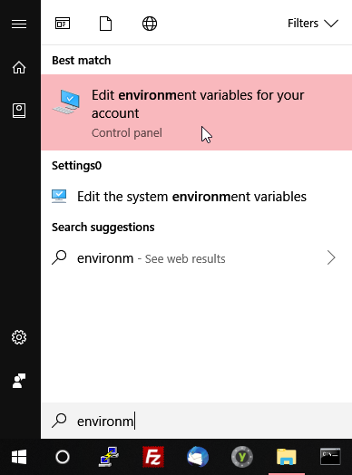
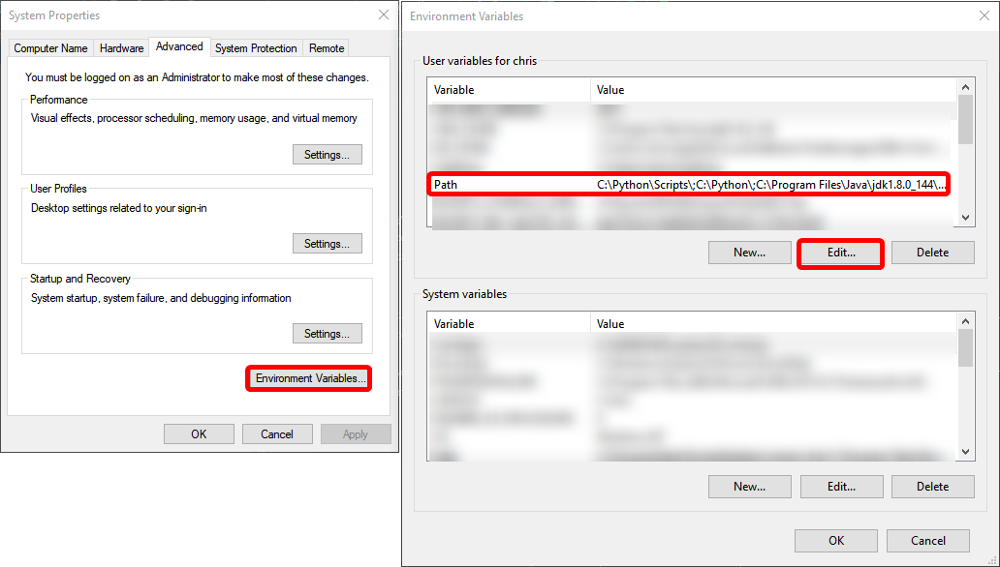

# cat-for-windows

A Go port of the popular 'cat' utility used to concatenate file(s) to standard output.
It can be compiled for most modern operating systems, but this is intended for use on Windows, since 
Linux and OSX already have the `cat` utility.


## Usage

```bash
cat <file>...
```

## Installation

1. Build the executable by following the instructions [here](#building-the-executable) or by downloading the
pre-built `cat.exe` executable.
2. Copy the `cat.exe` file to a folder you can add to your environment variables (e.g. `C:/bin`)
3. Add that folder to your `%PATH%` environment variable.




## Example

### Printing a single file to standard output

```bash
cat file.txt
```


### Printing multiple files to standard output

```bash
cat file.txt README.md
```


### Displaying the output line number

```bash
cat file.txt -n
```


## Building the executable

You can easily build the executable for your architecture with the following command:

```
go build
```

Alternatively, there's a pre-built executable for Windows.
